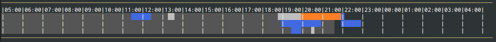

# org-timeline [](https://travis-ci.org/Fuco1/org-timeline)

Add graphical view of agenda to agenda buffer.



# Installation

After you install this package from MELPA Stable, add the following line to your org configuration:

``` emacs-lisp
(add-hook 'org-agenda-finalize-hook 'org-timeline-insert-timeline :append)
```

# How it works

This package adds a graphical view of the agenda after the last agenda line.  By default the display starts at 5 AM today and goes up to 4 AM next day (this covers 24 hours). This value can be customized with `org-timeline-beginning-of-day-hour`.

Scheduled tasks or tasks with time ranges are rendered in the display with `org-timeline-block` face.  Clocked entries are displayed in `org-timeline-clocked` face.  The background of timeslots which are in the past is highlighted with `org-timeline-elapsed` face.

You can use custom color for a task by adding the property `TIMELINE_FACE` with either a string which is a color name or a list which specifies the face properties or a symbol which is taken to be a face name.
You can choose to show the task's headlines in blocks, by setting `org-timeline-show-text-in-blocks` to a non-nil value. You can customize the text for a task with by adding the property `TIMELINE_TEXT` with a string.

# Further customization

## Overlapping blocks
By default, if two blocks overlap, one of them is drawn in the `org-timeline-overlap` face. You can set `org-timeline-overlap-in-new-line` to t, and overlapping blocks will be drawn in separate lines.
You can also be task-specific, and add the property `TIMELINE_DO_NOT_OVERLAP` with a non-nil value.

## Consecutive blocks
In order to make consecutive blocks distinct, every other consecutive block is decorated with a white overline. 

For the same reason, a character is added at the beginning of every block, if `org-timeline-show-text-in-blocks` is non-nil. By default, this character is a heavy vertical bar ❚, but it can be customized with `org-timeline-insert-before-text`.

## Special entries
By default, clocked entries will be shown in a dedicated line, in `org-timeline-clocked` face. If you do not like this, you can set `org-timeline-dedicated-clocked-line` to nil. 

You can also emphasize the next block to happen with `org-timeline-emphasize-next-block`. If non-nil, the next-block in today's line will be drawn in `org-timeline-next-block` face.

## Groups
You can add the string property `TIMELINE_GROUP` to your tasks. Every task with the same group name will be shown in a separate, dedicated line for that day.
The first three characters of the name will be shown at the beginning of that line.

## Rolling 24h cycle
You can set up org-timeline and org-agenda so that the timeline will show a rolling 24h cycle, starting a certain number of hours before now.
- Set `org-agenda-span` to 2 
- Set `org-timeline-beginning-of-day-hour` to 0 
- Set `org-timeline-keep-elapsed` to a positive integer (5, for example).

Run `org-agenda` in day mode.

# Other details
You can click on a block, it will take you to the corresponding task in the buffer.
The info line (just below the timeline) shows the details of the next task to happen. You can hit 'r' outside of the timeline to refresh the agenda and show the next task again.

# TODO

- [x] Add faces instead of colors
- [X] Make "midnight"/change-of-day configurable (currently 5 AM)
- [X] Add a tooltip showing the task description/name
- [X] Make the blocks navigable to the task
